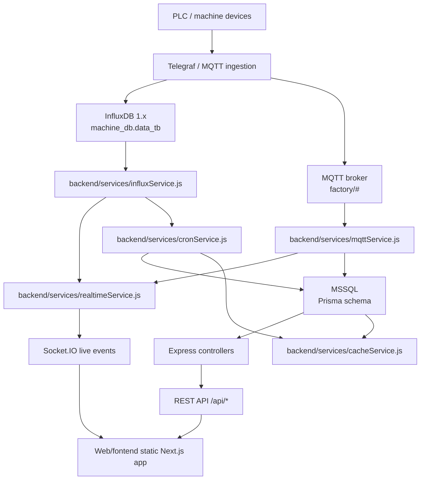

# AGENTS.md - OEE_FDB Agent Guide

This guide is for AI agents and developers working in this repository. Read it
before changing backend services, report logic, OEE calculations, config loading,
or any date/time behavior.

Do not treat this file as application code. It documents the current behavior
observed in the codebase.

## First Rules

- Do not rename `Web/fontend`; the misspelling is part of the current paths.
- Do not bypass shared service modules from controllers or React pages.
- Do not duplicate OEE math, hourly output fallback, or time conversion logic.
- Check `Web/docs/data-source-of-truth.md` and `DESIGN.md` before changing
  production data flow.
- When editing frontend source under `Web/fontend/src`, remember that production
  static output requires `npm run build`.

## Main Runtime Layout

```text
Web/backend/
  server.js                         Express, Socket.IO, routes, static frontend
  config/machine_calc.json          OEE/machine calculation modes
  config/machine_status.json        Status labels, colors, and groups
  utils/timeUtils.js                UTC shift helpers and TH hour column mapping
  services/oeeCalcService.js        OEE, availability, performance, quality math
  services/actualOutputService.js   Actual output fallback and current-hour rules
  services/realtimeService.js       Live dashboard payloads
  services/mqttService.js           MQTT ingestion and live state memory
  services/cronService.js           Hourly summary, backfill, OEE/NG sync
  prisma/schema.prisma              MSSQL schema mapping

Web/fontend/
  src/app/                          Next.js static-export app
```

## Architecture Overview

The backend is the integration boundary between machine data sources and the
frontend. The frontend must only use backend REST APIs and Socket.IO events; it
must not connect directly to MSSQL, InfluxDB, or MQTT.



Primary data paths:

| Path | Purpose |
| --- | --- |
| PLC/Telegraf -> InfluxDB -> cron -> MSSQL | Persist closed-hour output, CT, efficiency, NG, runtime, and recovery data. |
| PLC/MQTT -> mqttService memory -> realtimeService -> Socket.IO | Show live current-hour production/status quickly. |
| InfluxDB current hour -> realtimeService | Fill or verify current open-hour production data. |
| MSSQL/Prisma -> controllers -> REST API | Serve official historical dashboards and reports. |
| MSSQL/Prisma -> cacheService -> realtimeService | Reduce repeated MSSQL reads for live dashboard calculations. |

Agent boundary rule: if a change needs data from a machine source, add or reuse a
backend service. Do not move source-specific logic into controllers or frontend
pages.

## Config Loading Rules

### `config/machine_calc.json`

This is the main machine behavior config. It is read by:

- `services/oeeCalcService.js`
- `services/mqttService.js`
- `services/realtimeService.js`

Important keys:

| Key | Current meaning |
| --- | --- |
| `default_mode` | Default runtime/performance mode, currently `status_based`. |
| `custom_modes` | Prefix-based override by machine name, for example `AHV`, `ABR`. |
| `ng_modes` | Quality/NG mode. `default = visual_ng`, `ABR = over_reject`. |
| `ct_calc_modes` | CT calculation mode. `default = runtime_based`, `AHV = influx_avg`. |
| `timezone_modes` | MQTT status/alarm timestamp interpretation. `default = local`, `ABR = utc`. |
| `target_deduct_excluded` | Whether excluded status time reduces displayed target. |
| `availability_targets` | Availability target source, usually `eff_target`. |

Prefix matching means `machineName.startsWith(prefix)`. Prefer stable prefixes
such as `ABR` and `AHV`; do not add broad prefixes that can accidentally match
unrelated machines.

### `config/machine_status.json`

This config defines status display metadata by machine type:

- `machineTypes.AHV.statuses`
- `machineTypes.ABR.statuses`
- `default.statuses`

Status objects include `key`, `label`, `color`, and `group`.

Groups currently used conceptually:

| Group | Meaning |
| --- | --- |
| `running` | Productive running status, commonly `Run_Time`. |
| `excluded` | Planned/excluded time such as `Plan_Stop` or break/preventive cases. |
| `downtime` | Non-running downtime. |
| `offline` | Signal loss or disconnected state. |

Frontend config route:

- `GET /api/config/machine-status`
- Implemented in `Web/backend/routes/configRoutes.js`.

## Time Model Summary

The project has two different time concepts. Keep them separate:

1. Production shift date and hourly production columns are UTC-based.
2. Machine status/alarm event `Datetime` is physically stored as Thailand local
   time in MSSQL, while `UTC_Time` stores the original UTC timestamp when known.

### Shared Shift Helpers

Use `Web/backend/utils/timeUtils.js`.

| Helper | Behavior |
| --- | --- |
| `SHIFT_HOURS` | `07, 08, ..., 23, 00, 01, ..., 06`. These are TH display columns. |
| `utcHourToThColumn(0)` | Returns `07`. UTC midnight maps to TH 07:00. |
| `thColumnToUtcHour("07")` | Returns `0`. |
| `thColumnToUtcHour("00")` | Returns `17`. |
| `getShiftDateUTC(date)` | Returns `YYYY-MM-DD` from UTC date. |
| `getHourBoundariesUTC(dateStr, utcHour)` | Returns UTC start/end for one hour. |
| `getCurrentHourBoundaries(now)` | Returns UTC date, UTC hour, TH column, start, end. |

Shift rule:

```text
Shift date YYYY-MM-DD
  UTC:  YYYY-MM-DD 00:00 -> YYYY-MM-DD 23:59
  TH:   YYYY-MM-DD 07:00 -> next day 06:59
```

Example:

```text
UTC 2026-02-20 00:00 = TH 2026-02-20 07:00 -> column _07
UTC 2026-02-20 17:00 = TH 2026-02-21 00:00 -> column _00
UTC 2026-02-20 23:00 = TH 2026-02-21 06:00 -> column _06
```

## Table Time Rules

### Production / OEE date tables

These tables use `date @db.Date` as the UTC shift date, with hourly columns named
by Thailand display hour.

| Table | Date field | Hour fields | Time rule |
| --- | --- | --- | --- |
| `tb_output_target` | `date` | `target_07` ... `target_06` | `date` is UTC shift date. Columns are TH hour labels. |
| `tb_output_actual` | `date` | `actual_07` ... `actual_06` | Same as target. Closed hours from MSSQL; current open hour can be overridden by InfluxDB. |
| `tb_cycle_time_actual` | `date` | `cycle_07` ... `cycle_06` | Same shift mapping. |
| `tb_efficiency_actual` | `date` | `eff_07` ... `eff_06` | Same shift mapping. |
| `tb_availability_actual` | `date` | `avail_07` ... `avail_06` | Same shift mapping. |
| `tb_mc_runtime_hourly` | `date` | `runtime_07`, `excluded_07` ... `runtime_06`, `excluded_06` | Same shift mapping. Values are seconds. |
| `tb_machine_ng` | `date` | `ng_07` ... `ng_06` | Same shift mapping. `station_id = 0` is used for summary rows in some flows. |
| `tb_oee` | `date` | daily metrics | Daily result for the UTC shift date. |
| `tb_machine_holiday` | `holiday_date` | none | Date-only planning/holiday date. Treat like production date unless code says otherwise. |

Agent rule: when handling hourly columns, always convert through
`timeUtils.js`. Do not infer `_00` as the start of a DB date; `_00` belongs to
UTC hour 17 of the same shift date.

### Status / alarm event tables

These tables are special.

| Table | Fields | Time rule |
| --- | --- | --- |
| `tb_MCStatus` | `Datetime`, `UTC_Time` | `Datetime` is physically stored as Thailand local time. `UTC_Time` is the original UTC event time when available. |
| `tb_MCAlarm` | `Datetime`, `UTC_Time` | Same as `tb_MCStatus`. |

Important behavior from current code:

- `mqttService.js` reads `machine_calc.json.timezone_modes`.
- If a machine prefix is configured as `utc`, MQTT event time is shifted `+7h`
  before saving to `Datetime`.
- If a machine prefix uses `local`, MQTT event time is saved directly to
  `Datetime` because the source is expected to already be Thailand local time.
- In both cases, `UTC_Time` stores the parsed source UTC timestamp when present.
- `cronService.syncEventsFromInfluxDb()` treats InfluxDB status/alarm timestamps
  as UTC and always saves `Datetime = UTC + 7h`.
- `MCStatusController.getTimeline()` queries `Datetime` using Thai local shift
  boundaries, then subtracts 7h before returning timestamps to the frontend.

Agent warning: do not casually "fix" `tb_MCStatus.Datetime` to UTC without a
full migration plan. Current timeline and runtime logic expects Thai-local
physical storage in this column.

### Operator history table

| Table | Fields | Current behavior |
| --- | --- | --- |
| `tb_history_working` | `date`, `start_time`, `end_time` | `date` is date-only from the request. `start_time` and `end_time` are saved as `new Date(now + 7h)` in `HistoryWorkingController.js`. |

Agent warning: this table currently stores operator start/end time as a shifted
Thailand-local timestamp, not pure UTC. Treat changes here as high risk because
frontend display and cross-day active-session checks may rely on current shape.

### Plan config table

| Table | Fields | Current behavior |
| --- | --- | --- |
| `tb_machine_plan_config` | `active_hours`, `eff_target`, `cycle_time_target`, `oee_mode` | `active_hours` is JSON keyed by TH display hours (`07` ... `06`). |

`PlanConfigController.js` calculates target quantities from active hour count,
cycle time target, and efficiency target. Shift patterns:

| Pattern | Hours |
| --- | --- |
| `A` | `07`-`14` |
| `B` | `15`-`22` |
| `C` | `23`, `00`-`06` |
| `M` | `07`-`18` |
| `N` | `19`-`23`, `00`-`06` |

## Data Source Rules

| Source | Role |
| --- | --- |
| MSSQL via Prisma | Official persisted history and report data. |
| InfluxDB | Current-hour production output/cycle time and historical recovery source. |
| MQTT memory | Live machine status, live alarm, current-hour output/NG/CT before cron persistence. |

Output rules:

- Closed hours use MSSQL `tb_output_actual`.
- Current open hour can use InfluxDB or MQTT memory depending on the flow.
- Do not add current-hour InfluxDB output on top of MSSQL/cache for the same
  hour; replace or override the open hour only.
- If `tb_output_actual` has real model rows and `model_name = "--"` rows for the
  same hour, sum real model rows first. Use `"--"` only when no real row has
  output for that hour.
- Reuse `services/actualOutputService.js`.

## OEE Calculation Rules

Use `services/oeeCalcService.js`.

| Metric | Current rule |
| --- | --- |
| Availability | `runTime / (totalTime - excludedTime) * 100`, clamped to `0..100`. |
| Performance | `(outputForOee * idealCycleTime) / runTime * 100`, clamped to `0..150`. |
| Quality, `visual_ng` | `(totalOutput - ngQty) / totalOutput * 100`, floored at `0`. |
| Quality, `over_reject` | Always `100`; reject is deducted before performance. |
| OEE | `availability * performance * quality / 10000`; fallback only when explicitly passed. |

Runtime modes:

| Mode | Meaning |
| --- | --- |
| `status_based` | Uses MC status durations and `Run_Time`. |
| `output_based` | Uses output and CT when reliable status runtime is unavailable. |

CT modes:

| Mode | Meaning |
| --- | --- |
| `runtime_based` | CT comes from runtime seconds divided by output. |
| `influx_avg` | CT comes from accumulated source/MQTT average behavior. |

NG modes:

| Mode | Meaning |
| --- | --- |
| `visual_ng` | Manual/visual NG affects quality. |
| `over_reject` | Station NG is treated as reject deducted from output; quality stays `100`. |

## Key Dashboard Calculations

These formulas appear in dashboard/report behavior and should stay consistent
with service code.

Efficiency:

```text
totalValidSeconds = allPastHours * 3600 + elapsedSecondsInCurrentHour
theoreticalMax = totalValidSeconds / avgCycleTime
efficiency = (totalOutput / theoreticalMax) * 100
```

Important note: `totalValidSeconds` counts all past hours in the visible shift,
including idle hours, not only hours that have output.

Cycle time weighted average:

```text
avgCycleTime = sum(cycleTime * output) / sum(output)
```

Only include hours where both `output > 0` and `cycleTime > 0`.

Achieve:

```text
achieve = (totalOutput / accumTarget) * 100
```

`accumTarget` is the sum of hourly targets up to the current hour. Current-hour
target can be prorated by elapsed time depending on the dashboard flow.

## Backend Services

| Service | Role |
| --- | --- |
| `services/realtimeService.js` | Runs live dashboard loops, merges current-hour MQTT/cache/Influx data, emits Socket.IO payloads, and broadcasts `server_time`. |
| `services/cacheService.js` | Keeps in-memory per-machine shift data such as output, CT, efficiency, target, availability, runtime, and NG. Hydrated from MSSQL and updated by cron/realtime paths. |
| `services/cronService.js` | Summarizes previous hours, handles late data, persists NG/OEE/runtime, runs daily sync/rollover, and recovers missing InfluxDB history. |
| `services/influxService.js` | InfluxDB 1.x query boundary. Provides production, NG, status, and alarm query functions. |
| `services/mqttService.js` | MQTT ingestion, live status/alarm writes, current-hour output/NG/CT memory, station NG parsing, and timestamp conversion based on `timezone_modes`. |
| `services/oeeCalcService.js` | Shared OEE formulas and machine config-mode lookups. |
| `services/actualOutputService.js` | Shared output aggregation, model-row fallback, and current-hour override helpers. |

Backend service rule: if logic is reused by controllers, cron, realtime, or
reports, keep it in a service and test the service when feasible.

## Realtime Rules

`services/realtimeService.js` has two loops:

- Fast loop: default every 2 seconds. Uses MQTT memory and cache for live output.
- Slow loop: default every 5 minutes. Uses MSSQL/status/OEE data.
- It also broadcasts `server_time` every 1 second.

Realtime payloads use:

- `serverTimeUTC`: ISO UTC string.
- `shiftDate`: UTC shift date.
- `currentHourTH`: TH display hour column for the current UTC hour.
- `currentShiftIndex`: index in `SHIFT_HOURS`.

Frontend pages should merge socket payloads into state. They should not refetch
full API data on every socket event.

Frontend consumption pattern:

| Page | Initial load | Realtime update |
| --- | --- | --- |
| `machine_working` | Fetches table/graph/OEE/model data from APIs. | Socket updates visible table and graph state. |
| `overall_machine_working` | Loads one card dataset per machine. | Merges realtime data into each card. |
| `layout_dashboard` | Loads machine list and today's values. | Merges output, efficiency, CT, and live status into machine cards. |

## Cron Rules

`services/cronService.js` is the persistence and recovery path.

Important schedules are environment-configurable:

| Env var | Default | Meaning |
| --- | --- | --- |
| `CRON_HOURLY` | `0 * * * *` | Summarize previous hour. |
| `CRON_LATE_DATA` | `*/15 * * * *` | Check late data. |
| `CRON_DAILY_ROLLOVER` | `5 0 * * *` | Rollover at 00:05 UTC / 07:05 TH. |
| `CRON_NG_HOURLY` | `10 * * * *` | Persist hourly NG. |
| `CRON_OEE_HOURLY` | `5 * * * *` | Upsert hourly OEE components. |
| `CRON_DAILY_SYNC` | `15 0 * * *` | Daily Influx to MSSQL sync at 00:15 UTC / 07:15 TH. |
| `CRON_AUTO_PLAN` | `10 0 * * *` | Auto plan at 00:10 UTC / 07:10 TH. |

Cron code generally uses UTC boundaries and maps the target hour to TH columns
through `timeUtils.js`.

## InfluxDB Rules

InfluxDB is queried through `services/influxService.js`; do not query it directly
from controllers or frontend code.

Known current configuration from existing docs:

| Item | Value |
| --- | --- |
| Host | `192.168.100.99:5012` |
| Database | `machine_db` |
| Production measurement | `data_tb` |
| Event measurements | `status_tb`, `alarm_tb` |
| Production fields | `output_count`, `cycle_time` |
| Common tag | `machine_name` |

Common query roles:

- Current-hour data for realtime dashboards.
- Previous-hour summaries for cron persistence.
- Startup and late-data recovery.
- Status/alarm event recovery into MSSQL.

InfluxDB event timestamps are treated as UTC when syncing into MSSQL
`tb_MCStatus` and `tb_MCAlarm`; the saved `Datetime` is shifted to Thai local
physical time.

## Frontend Pages

| Page | Purpose |
| --- | --- |
| `Web/fontend/src/app/oee_production/machine_area/page.tsx` | Machine selection with area/type filters and scan/history actions. |
| `Web/fontend/src/app/machine_working/page.tsx` | Single-machine detail view with graphs and operator state. |
| `Web/fontend/src/app/overall_machine_working/page.tsx` | Multi-machine card dashboard. |
| `Web/fontend/src/app/oee_production/layout_dashboard/page.tsx` | Factory floor layout dashboard. |
| `Web/fontend/src/app/oee_production/production_planing/page.tsx` | Production target planning. |
| `Web/fontend/src/app/oee_production/daily_report/page.tsx` | Daily OEE report. |
| `Web/fontend/src/app/oee_production/monthly_report/page.tsx` | Monthly OEE report. |
| `Web/fontend/src/app/oee_production/machine_report/page.tsx` | Machine-specific report. |
| `Web/fontend/src/app/oee_production/machine_ng/page.tsx` | Machine NG report/update workflow. |
| `Web/fontend/src/app/oee_production/update_oee/page.tsx` | Manual OEE/NG update workflow. |

Additional page notes:

| Page | Notes |
| --- | --- |
| `machine_area/page.tsx` | Area and machine type filters are persisted in localStorage. It opens scan/login and history modals. |
| `machine_working/page.tsx` | Reads current machine from localStorage or URL params, fetches once, updates from sockets, and handles shift/date rollover. |
| `overall_machine_working/page.tsx` | Renders `OverallMachineCard` grids, usually with output and CT/efficiency graphs. Some flows lazy-load cards in batches. |
| `layout_dashboard/page.tsx` | Uses hardcoded layout positions such as `MACHINE_POSITIONS` for factory-floor style cards and supports output/efficiency/CT display modes. |

Known localStorage keys:

| Key | Purpose |
| --- | --- |
| `machineAreaLocal` | Selected area filter. |
| `machineTypeFilterLocal` | Selected machine type filter. |
| `machineNameLocal` | Current machine name for machine detail pages. |
| `machineDateLocal` | Current viewing date. |
| `operatorLocal` | Active operator ID when logged in. |

## API Route Map

Routes are registered mainly in `Web/backend/server.js`.

| Method | Route | Controller / module | Purpose |
| --- | --- | --- | --- |
| `GET` | `/api/oee/getDataTable` | `OeeDashboardController` | Dashboard table data. |
| `GET` | `/api/oee/getGraph1` | `OeeDashboardController` | Output graph data. |
| `GET` | `/api/oee/getGraph2` | `OeeDashboardController` | CT and efficiency graph data. |
| `GET` | `/api/oee/getLastOEE` | `OeeDashboardController` | Latest OEE by machine. |
| `GET` | `/api/oee/getModelsByDate` | `OeeDashboardController` | Models for a selected date. |
| `GET` | `/api/oee/getPicture/:emp_no` | `OeeDashboardController` | Operator picture. |
| `GET` | `/api/model/listModel` | `ModelController` | Model list. |
| `GET` | `/api/model/listModelType` | `ModelController` | Model type list. |
| `GET` | `/api/machine/listArea` | `MachineController` | Machine area list. |
| `GET` | `/api/machine/listType/:area` | `MachineController` | Machine type list for an area. |
| `GET` | `/api/machine/listMachines/:area/:type` | `MachineController` | Machine list for type and area. |
| `GET` | `/api/machine/listTypeWithMachines/:area` | `MachineController` | Types with machines. |
| `GET` | `/api/machine/listProcess/:machine_type` | `MachineController` | Process list by machine type. |
| `GET` | `/api/machine/listAllMachinesByArea` | `MachineController` | Layout dashboard machine list by area. |
| `GET` | `/api/machine/getMachinesWithTodayData` | `MachineController` | Layout dashboard card data. |
| `POST` | `/api/historyWorking/createStartTime` | `HistoryWorkingController` | Start operator session. |
| `PUT` | `/api/historyWorking/updateEndTime/:id` | `HistoryWorkingController` | End operator session. |
| `GET` | `/api/historyWorking/getOperatorIdWorking/:machine_name` | `HistoryWorkingController` | Current active operator. |
| `GET` | `/api/historyWorking/getHistoryByDate` | `HistoryWorkingController` | Operator history for date. |
| `GET` | `/api/historyWorking/getActiveCrossDayOperator` | `HistoryWorkingController` | Cross-day active operator lookup. |
| `POST` | `/api/outputTarget/createOutputTargetRange` | `OutputTargetController` | Create production target range. |
| `PUT` | `/api/outputTarget/updateOutputTargetRange` | `OutputTargetController` | Update production target range. |
| `DELETE` | `/api/outputTarget/deleteOutputTarget` | `OutputTargetController` | Delete production target. |
| `GET` | `/api/outputTarget/getOutputTarget` | `OutputTargetController` | List output targets. |
| `GET` | `/api/outputTarget/getLastTargetDate` | `OutputTargetController` | Last target date for a machine. |
| `GET` | `/api/planConfig/get/:machine_name` | `PlanConfigController` | Machine planning config. |
| `POST` | `/api/planConfig/upsert` | `PlanConfigController` | Save planning config. |
| `GET` | `/api/planConfig/list` | `PlanConfigController` | List planning configs. |
| `POST` | `/api/planConfig/generatePlan` | `PlanConfigController` | Generate production plan. |
| `POST` | `/api/planConfig/updateDayShift` | `PlanConfigController` | Update one day's shift pattern. |
| `POST` | `/api/planConfig/updateDayHours` | `PlanConfigController` | Update one day's active hours. |
| `POST` | `/api/planConfig/updateDayEffCt` | `PlanConfigController` | Update one day's efficiency and CT target. |
| `GET` | `/api/holiday/list/:machine_name` | `HolidayController` | List machine holidays. |
| `POST` | `/api/holiday/toggle` | `HolidayController` | Toggle holiday. |
| `POST` | `/api/holiday/copy` | `HolidayController` | Copy holidays. |
| `GET` | `/api/oee-update/list` | `OeeUpdateController` | List OEE update rows. |
| `POST` | `/api/oee-update/set-mode` | `OeeUpdateController` | Set OEE mode. |
| `POST` | `/api/oee-update/manual-ng` | `OeeUpdateController` | Save manual NG. |
| `POST` | `/api/oee-update/manual-ng-batch` | `OeeUpdateController` | Save manual NG batch. |
| `POST` | `/api/oee-update/manual-ng-multi-machine` | `OeeUpdateController` | Save manual NG for multiple machines. |
| `GET` | `/api/oee-update/history/:machine` | `OeeUpdateController` | OEE update history. |
| `GET` | `/api/oee-update/auto-ng/:machine` | `OeeUpdateController` | Auto NG details. |
| `GET` | `/api/report/daily-dashboard` | `ReportDashboardController` | Daily report dashboard. |
| `GET` | `/api/report/monthly-dashboard` | `ReportDashboardController` | Monthly report dashboard. |
| `GET` | `/api/report/machine-report` | `ReportController` | Machine-specific report. |
| `GET` | `/api/report/machine-ng-report` | `MachineNgController` | Machine NG report. |
| `GET` | `/api/mcstatus/timeline` | `MCStatusController` | Machine status timeline. |
| `GET` | `/api/mcstatus/latest-all` | `MCStatusController` | Latest status for all machines. |
| `GET` | `/api/config/machine-status` | `configRoutes` | Frontend machine status config. |

## Development Workflow

Backend:

```powershell
cd Web/backend
npm test
node --watch server.js
```

Frontend:

```powershell
cd Web/fontend
npm run dev
npm run build
```

Production/static behavior:

- `Web/fontend/next.config.ts` uses static export behavior.
- Backend serves built files from `Web/fontend/out`.
- Source changes under `Web/fontend/src` do not appear in the backend-served app
  until `npm run build` regenerates `out`.
- Backend changes reload when running through `node --watch server.js`.

## Safe Change Checklist

Before editing code that touches config or time:

1. Identify the table being read or written.
2. Identify whether the table stores a date-only shift date, a UTC timestamp, or
   Thailand-local physical `Datetime`.
3. Check whether the machine has a prefix override in `machine_calc.json`.
4. Use `timeUtils.js` for `_07` ... `_06` hourly column mapping.
5. Use `actualOutputService.js` for output fallback/override behavior.
6. Use `oeeCalcService.js` for OEE math and config-mode lookup.
7. Add/update tests when changing shared formulas, report aggregation, current
   hour override, or timestamp conversion.

## High-Risk Areas

- Changing `tb_MCStatus.Datetime` semantics.
- Changing `timezone_modes` behavior without checking MQTT and Influx backfill.
- Changing shift boundaries from UTC `00:00..23:59`.
- Treating `_00` columns as the start of a calendar date.
- Recomputing current-hour output by summing MSSQL/cache and Influx together.
- Reading machine modes by exact machine name only; current config is prefix
  based.
- Creating report-specific OEE formulas instead of using shared services.
