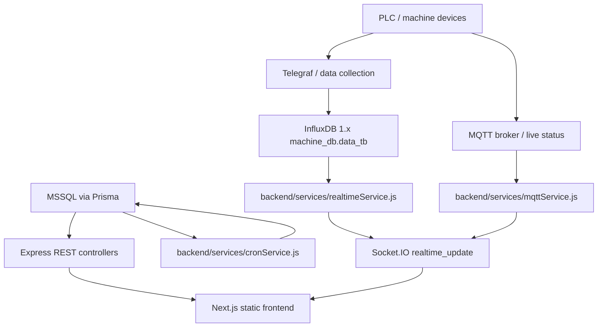

# OEE_FDB Design

This document describes the current design of the OEE production monitoring
system. It is intended as the first place to look before changing data flow,
OEE formulas, realtime updates, or report behavior.

## Goals

- Track machine production and status in near real time.
- Preserve official historical production data in MSSQL.
- Use InfluxDB for current-hour machine output and cycle time.
- Use MQTT memory for live machine status and stopwatch state.
- Present OEE dashboards, daily reports, monthly reports, machine reports, and
  NG updates through a static Next.js frontend served by the backend.

## Repository Layout

```text
OEE_FDB/
  GetData/ABR_Data/             PLC/Telegraf data collection assets
  Web/backend/                  Express API, Socket.IO, Prisma, services
  Web/fontend/                  Next.js frontend; keep the misspelled name
  Web/docs/                     Supporting documentation and screenshots
  Documents/                    Training and user-facing documents
```

Important note: the frontend directory is named `fontend`. Do not rename it
unless all backend static-file paths and deployment scripts are updated too.

## Runtime Architecture



The backend is the integration boundary. Frontend pages should call backend
APIs and listen to Socket.IO; they should not connect directly to MSSQL,
InfluxDB, or MQTT.

## Backend Design

The backend lives in `Web/backend`.

Primary responsibilities:

- Serve REST endpoints under `/api/*`.
- Serve the static frontend export from `Web/fontend/out`.
- Own Socket.IO realtime events.
- Query MSSQL through Prisma.
- Query InfluxDB through service modules.
- Run cron/worker jobs that summarize and repair production data.

Key modules:

| Area | Files | Responsibility |
| --- | --- | --- |
| API entry | `server.js` | Express setup, middleware, route registration, static frontend serving |
| Controllers | `controllers/*Controller.js` | Request/response handling only; keep business logic in services |
| Prisma schema | `prisma/schema.prisma` | MSSQL data model |
| Realtime | `services/realtimeService.js`, `services/mqttService.js` | Current machine state and Socket.IO payloads |
| Influx | `services/influxService.js` | InfluxDB query boundary |
| OEE math | `services/oeeCalcService.js` | Shared formulas for availability, performance, quality, and OEE |
| Output rules | `services/actualOutputService.js` | Historical/current-hour output source selection |
| Reports | `controllers/ReportDashboardController.js`, `services/reportDashboardService.js` | Daily and monthly dashboard report APIs |

Controllers should stay thin. If logic is shared by dashboards, reports, cron,
or realtime flows, put it in a service and unit-test the service.

## Frontend Design

The frontend lives in `Web/fontend` and uses Next.js static export.

Primary routes:

| Route | Purpose |
| --- | --- |
| `/machine_working` | Single-machine realtime page |
| `/overall_machine_working` | Multi-machine overview cards |
| `/oee_production/layout_dashboard` | Factory floor layout dashboard |
| `/oee_production/production_planing` | Production target planning |
| `/oee_production/daily_report` | Daily OEE report |
| `/oee_production/monthly_report` | Monthly OEE report |
| `/oee_production/machine_report` | Machine-specific report |
| `/oee_production/machine_ng` | NG update/report workflow |
| `/oee_production/update_oee` | Manual OEE/NG update workflow |

Shared frontend behavior:

- Use REST APIs for initial and historical loads.
- Use the shared dashboard socket path for live dashboard updates.
- Do not re-fetch full API datasets on every socket event. Merge the socket
  payload into visible state.
- Keep report components reusable when daily and monthly pages share behavior.

## Data Source Rules

The system has three data source roles:

| Source | Role |
| --- | --- |
| MSSQL via Prisma | Official historical and persisted production data |
| InfluxDB | Current open-hour production output and cycle time |
| MQTT memory | Live machine status and stopwatch state |

Output rules:

1. Closed hours use MSSQL `tb_output_actual`.
2. The current open hour uses InfluxDB when the requested date is the current
   shift date.
3. If MSSQL/cache has a value for the current hour, replace that hour with the
   InfluxDB value instead of adding both values.
4. If an hour has real model rows and `model_name = "--"` rows, prefer summed
   real model rows. Use `"--"` only when no real model row has output.
5. Reuse `actualOutputService` instead of duplicating fallback logic.

OEE formula rules live in `oeeCalcService` and should be reused by dashboards,
reports, cron jobs, and manual update flows.

## Time Model

The production day follows a Thailand shift boundary:

| Concept | Value |
| --- | --- |
| Display timezone | Thailand, UTC+7 |
| Shift start | 07:00 Thailand time |
| Shift end | 06:59 Thailand time next day |
| Hour columns | `07, 08, ..., 23, 00, 01, ..., 06` |

Use shared time helpers instead of creating page-specific conversions. This
keeps table columns, graph points, cron jobs, and socket payloads aligned.

## Realtime Payload

Socket.IO emits a `realtime_update` event that represents the current shift and
machine map. Consumers should expect:

```js
{
  serverTimeUTC: "2026-02-20T01:30:00.000Z",
  shiftDate: "2026-02-20",
  currentHourTH: "08",
  currentShiftIndex: 1,
  elapsedSeconds: 1800,
  machines: {
    "DLC-002": {
      currentHour: {
        hour: "08",
        output: 150,
        cycleTime: 2.35,
        efficiency: 85.5
      },
      daily: {
        totalOutput: 300,
        accumTarget: 320,
        achieve: 93.75,
        avgCycleTime: 2.4,
        overallEfficiency: 82.1,
        hourly: {
          output: [],
          cycleTime: [],
          efficiency: [],
          outputAccum: []
        }
      }
    }
  }
}
```

The payload should be treated as the current live projection, not as a full
historical source.

## Report Design

Daily and monthly report dashboards should share the same conceptual shape:

- Filters select date/month, area, type, machine, or process scope.
- Backend service resolves source data and applies OEE formulas.
- Frontend report component renders summary cards, charts, and tables.
- Exports should use the same data already shown on screen.

Historical report pages should not silently mix current-hour InfluxDB data into
closed historical periods. Current-hour overrides are only appropriate when the
visible report period includes the active shift date/month and the endpoint is
designed for live dashboard behavior.

## Build And Verification

Backend:

```powershell
cd Web/backend
npm test
node server.js
```

Frontend:

```powershell
cd Web/fontend
npm run build
npm run dev
```

Because the backend serves `Web/fontend/out`, frontend source changes under
`Web/fontend/src` require `npm run build` before they appear in the production
static output.

## Change Guidelines

- Preserve the `fontend` directory name.
- Keep controllers small and move reusable logic into services.
- Keep data-source decisions centralized in service modules.
- Add or update unit tests when changing OEE formulas, output fallback, report
  aggregation, realtime payload shape, or time conversion.
- Avoid direct database or Influx logic in React components.
- Do not introduce a new realtime event shape without updating every dashboard
  consumer.
- Prefer explicit API contracts for new report endpoints: define historical
  source, current-hour source, time zone, filters, and aggregation level.

